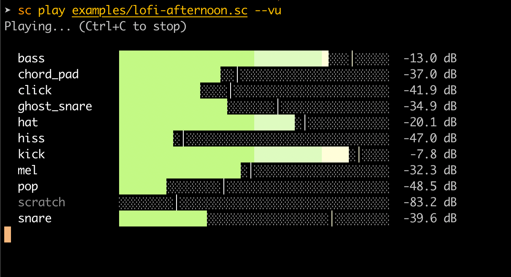

# Sound Cabinet

A DSL-driven sound synthesis tool. Write compositions in a simple text format, render them to WAV, or play them through your speakers in real-time. A streaming mode lets you pipe instructions in line-by-line — designed for both human composers and generative AI.



## Install

### Pre-built binaries

Download the latest release for your platform from [Releases](https://github.com/rbeverly/sound-cabinet/releases):

```bash
# macOS (Apple Silicon)
curl -L https://github.com/rbeverly/sound-cabinet/releases/latest/download/sound-cabinet-aarch64-apple-darwin.tar.gz | tar xz
sudo mv sound-cabinet /usr/local/bin/

# macOS (Intel)
curl -L https://github.com/rbeverly/sound-cabinet/releases/latest/download/sound-cabinet-x86_64-apple-darwin.tar.gz | tar xz
sudo mv sound-cabinet /usr/local/bin/

# Linux (x86_64)
curl -L https://github.com/rbeverly/sound-cabinet/releases/latest/download/sound-cabinet-x86_64-unknown-linux-gnu.tar.gz | tar xz
sudo mv sound-cabinet /usr/local/bin/
```

On Windows, download `sound-cabinet-x86_64-pc-windows-msvc.zip` from [Releases](https://github.com/rbeverly/sound-cabinet/releases), extract it, and add the folder to your PATH (or move `sound-cabinet.exe` to a directory already in your PATH).

### Build from source

Requires [Rust](https://www.rust-lang.org/tools/install) (1.70+):

```bash
curl --proto '=https' --tlsv1.2 -sSf https://sh.rustup.rs | sh  # if you don't have Rust
git clone https://github.com/rbeverly/sound-cabinet.git
cd sound-cabinet
cargo build --release
```

The binary will be at `target/release/sound-cabinet` (or `target\release\sound-cabinet.exe` on Windows). Either copy it to a system directory or add the build output to your PATH:

```bash
# Option A: copy to a system directory (macOS/Linux)
cp target/release/sound-cabinet /usr/local/bin/

# Option B: add to your PATH (run from the sound-cabinet directory)

# bash (~/.bashrc)
echo 'export PATH="$PATH:'$(pwd)'/target/release"' >> ~/.bashrc && source ~/.bashrc

# zsh (~/.zshrc)
echo 'export PATH="$PATH:'$(pwd)'/target/release"' >> ~/.zshrc && source ~/.zshrc

# fish (~/.config/fish/config.fish)
echo 'fish_add_path '(pwd)'/target/release' >> ~/.config/fish/config.fish && source ~/.config/fish/config.fish
```

On Windows (PowerShell):

```powershell
# Add to your user PATH permanently
$env:PATH += ";$PWD\target\release"
[Environment]::SetEnvironmentVariable("PATH", $env:PATH, "User")
```

#### Platform dependencies

**macOS** — audio support is built in, no extra dependencies needed.

**Linux** — you may need ALSA development libraries for audio output:

```bash
# Debian/Ubuntu
sudo apt install libasound2-dev

# Fedora
sudo dnf install alsa-lib-devel
```

**Windows** — no extra dependencies needed. Audio uses WASAPI (built into Windows).

## Usage

```bash
# Render a score to a WAV file
sound-cabinet render song.sc -o output.wav

# Render with loudness normalization (e.g. Spotify = -14 LUFS)
sound-cabinet render song.sc -o output.wav --lufs -14

# Play through speakers
sound-cabinet play song.sc

# Play with verbose output (shows beat positions and pattern names)
sound-cabinet play song.sc -v

# Skip ahead to a specific beat
sound-cabinet play song.sc --from 140

# Solo a specific voice
sound-cabinet play song.sc --solo bass
sound-cabinet play song.sc --solo bass,melody

# Live VU meters during playback
sound-cabinet play song.sc --vu

# Sub-bass fold-up monitoring (hear sub-bass on headphones)
sound-cabinet play song.sc --subfold

# Environment noise simulation (test mix translation)
sound-cabinet play song.sc --env car
sound-cabinet play song.sc --env cafe
sound-cabinet play song.sc --env subway

# Profile per-voice levels
sound-cabinet profile song.sc

# Freeze — expand all randomness into flat .sc
sound-cabinet freeze song.sc
sound-cabinet freeze song.sc --seed 42 -o frozen.sc

# Watch mode — live reload on file save
sound-cabinet watch song.sc

# Piano mode — play instruments with keyboard or MIDI
sound-cabinet piano voices/kit.sc piano --midi --velocity supersoft

# Stream mode — pipe in lines for real-time playback
sound-cabinet stream

# Generate phrases from pattern files
sound-cabinet generate --pattern patterns/bass/walking-jazz.yaml \
  --key D --mode dorian --chords "Dm7 G7 Cmaj7 Am7" \
  --voice bass --variations 5 -o generated.sc

# Export sheet music (LilyPond or PDF)
sound-cabinet export song.sc -o song.pdf --key Am --title "My Song"
```

## Quick Start

Score files (`.sc`) are plain text. Lines starting with `//` are comments.

### Define sounds

```sc
bpm 120

// A voice is a complete signal graph
voice pad = (saw(C3) + 0.5 * sine(C4)) >> lowpass(2000, 0.7) >> reverb(0.6, 0.4, 0.3)

// An instrument is a template — 'freq' gets substituted with the note's Hz
instrument piano = saw(freq) >> lowpass(freq * 4, 0.7) >> decay(8) >> reverb(0.6, 0.3, 0.2)

// An fx is a reusable effect chain
fx hall = reverb(0.8, 0.4, 0.35) >> delay(0.3, 0.2, 0.15)

// Stereo panning — place instruments in the stereo field
instrument piano = saw(freq) >> decay(8) >> pan(-0.3)        // slightly left
instrument bass = sine(freq) >> decay(12) >> pan(0.0)        // center
voice hat = noise() >> highpass(8000) >> decay(25) >> pan(0.6)  // right
```

All output is stereo (2-channel WAV). Without `pan()`, voices play center. `pan()` uses equal-power panning: -1.0 = full left, 0.0 = center, 1.0 = full right.

### Custom waveforms

```sc
// Define arbitrary wave shapes — the array is one cycle, played at any frequency
wave plateau = [0.0, 0.4, 0.8, 1.0, 1.0, 1.0, 0.8, 0.4, 0.0, -0.4, -0.8, -1.0, -1.0, -1.0, -0.8, -0.4]
wave spike = [0.0, 1.0, 0.3, 0.1, 0.0, -0.1, -0.3, -1.0]

at 0 play 0.3 * plateau(C3) >> lowpass(2000, 0.7) for 4 beats
at 4 play 0.3 * spike(A4) >> reverb(0.6, 0.4, 0.25) for 4 beats
```

Fewer points = crunchier (8-bit character). More points = smoother. Asymmetric waves add even harmonics (tube/tape warmth). Custom waves work with instruments, effects, and arp.

### Schedule playback

```sc
// Play at specific beats
at 0 play pad for 4 beats
at 0 play piano(C4) for 2 beats
at 2 play piano(E4) for 2 beats

// Note names: A4 = 440 Hz, C4 = middle C, Bb3 = B-flat 3
at 0 play piano(Bb3) >> hall for 4 beats

// Multi-note instrument calls — play chords through any instrument
at 0 play piano(C4, E4, G4) for 2 beats
```

### Patterns and sections

```sc
// Patterns group events with relative timing
pattern drums = 4 beats
  at 0 play kick for 0.5 beats
  at 1 play snare for 0.25 beats
  at 2 play kick for 0.5 beats
  at 3 play snare for 0.25 beats

// Sections compose patterns — all entries play simultaneously by default
section verse = 16 beats
  repeat drums every 4 beats              // tile every 4 beats
  repeat hats from 8 to 16               // tile only in beat range 8-16
  repeat bass until 12                    // tile from 0 until beat 12
  play melody_line                        // play once from beat 0
  play fill from 8                        // play once starting at beat 8
  sequence bass_a, bass_b                 // play back-to-back (sequential)
  at 12 play transition for 2 beats       // inline event at specific beat
  repeat 4 {                              // repeat block with random selection
    pick [groove_a, groove_b]
  }

// Implicit section length — computed from contents if omitted
section auto_length
  at 0 play intro_8beat
  at 8 play verse_32beat

// sample() — slice a pattern by beat range
play sample(melody, 0, 16)               // first 16 beats only
play sample(melody, 16)                  // beat 16 to end
repeat sample(drums, 0, 4) every 4 beats

// Sequential play at top level
play intro
play verse
play chorus
play verse
play outro

// Repeat with random selection at top level
repeat 8 {
  pick [verse_a:2, verse_b:2, chorus:1]
}
```

### Tempo changes

```sc
bpm 78
play intro
play verse

bpm 82
play chorus

bpm 78
play bridge
```

### Voice substitution

```sc
with kick = 808_kick, snare = clap
play drums   // uses substituted voices
```

### Arpeggiator

```sc
voice pluck = 0.3 * saw(0) >> lowpass(2000, 0.8) >> decay(10)
at 0 play pluck >> arp(C:m7, 4, updown, gate, 0.5) for 8 beats
```

### Sustain pedal

```sc
pedal down at 4.0                      // sustain all voices
pedal down piano at 4.0                // sustain only piano
pedal down [piano, strings] at 4.0     // sustain multiple voices
pedal up piano at 8.0
```

### Mixing

```sc
// Normalize instruments to consistent levels
normalize bass 0.5
normalize piano 0.5

// Master bus control
master compress 1.0
master gain -3

// Master EQ curve — shape frequency balance for translation
master curve car                          // preset: reduces sub-bass, boosts presence
master curve low -4, mid 0, high 3       // manual per-band (dB)

// Multiband compressor — per-band dynamic control
master multiband 0.3                      // 0=off, 1.0=OTT-level

// Soft clipper — warm saturation for harmonics + translation
master saturate 0.5

// Harmonic exciter — adds sparkle to cut through noise
instrument lead = saw(freq) >> decay(6) >> excite(3000, 0.5)
```

See [Expressions & Effects](docs/expressions.md) for the full reference.

## Common Mistakes

### Nesting patterns inside patterns

Patterns cannot contain other patterns or sections. A pattern is a flat list of events:

```sc
// WRONG:
pattern verse = 8 beats
  pattern melody = 4 beats       // nesting not supported

// RIGHT — define patterns separately, compose with sections:
pattern melody = 4 beats
  at 0 play piano(C4) for 1 beat

section verse = 8 beats
  repeat melody every 4 beats
```

### Playing patterns in alternation

```sc
// WRONG — both play simultaneously (at section beat 0):
section broken = 16 beats
  play pattern_a
  play pattern_b

// RIGHT — use sequence for back-to-back play:
section alternating = 16 beats
  sequence pattern_a, pattern_b
```

### Inaudible voices

Gain is linear, not logarithmic. The difference between `* 0.5` and `* 0.01` is huge:

| Linear gain | dB level | Perception |
|-------------|----------|------------|
| `* 1.0` | 0 dB | Full volume |
| `* 0.5` | -6 dB | Noticeably quieter |
| `* 0.1` | -20 dB | Quiet |
| `* 0.01` | -40 dB | Nearly inaudible |

Use `sound-cabinet profile song.sc` to check levels. Or use `normalize` to auto-level instruments.

### Forgetting that `with` is not `play`

```sc
// WRONG — defines substitutions but never plays:
with kick = 808_kick, snare = clap

// RIGHT — with followed by play:
with kick = 808_kick, snare = clap
play drums_pattern
```

### Effects without a source

```sc
// WRONG — reverb of nothing:
at 0 play reverb(0.8, 0.4, 0.3) for 4 beats

// RIGHT:
at 0 play saw(C3) >> reverb(0.8, 0.4, 0.3) for 4 beats
```

## Examples

The `examples/` directory includes complete compositions:

| File | Description |
|---|---|
| `demo.sc` | Basic features walkthrough |
| `effects-demo.sc` | Effects, arp, pulse, PWM sweep, filter automation, compression |
| `concerto2.sc` | Rachmaninoff Piano Concerto No. 2 (converted from MIDI) |
| `lofi-afternoon.sc` | Lofi hip-hop with swing, chorus, distortion, vibrato |
| `wave-test.sc` | Custom waveform demo |
| `instrument-demo.sc` | Default instrument library showcase |
| `black-glass.sc` | Downtempo electronic |
| `neon-cascade.sc` | Progressive house |
| `three-faces.sc` | Classical theme reinterpreted as jazz, ragtime, and drum & bass |

Voice kits in `examples/voices/` define reusable instrument sets. The **default instrument library** (`voices/instruments.sc`) includes 20+ instruments across 5 families (keys, plucked strings, pads, bass, mallets) plus texture voices and effect chains.

## Documentation

| Guide | Topics |
|-------|--------|
| [Expressions & Effects](docs/expressions.md) | Oscillators, filters, envelopes, effects, EQ, sidechain, arp, chords, instruments, operators |
| [Patterns, Sections & Composition](docs/sections-and-patterns.md) | Patterns, sections, from/to ranges, sequence, repeat blocks, tempo changes, pedal, swing, humanize |
| [Master Bus & Loudness](docs/master-bus.md) | Master bus chain, compression, limiter, LUFS measurement, normalization |
| [Piano Mode & MIDI](docs/piano-mode.md) | Live keyboard/MIDI play, velocity curves, recording, sustain pedal |
| [Mixing & Diagnostics](docs/mixing.md) | Profile, solo, VU meters, normalize, level troubleshooting |
| [Algorithmic Generation](docs/algorithmic-generation.md) | Pattern-driven phrase generation, motif/transformation system, song structures |
| [Instrument Generation](docs/instrument-generation.md) | Trait-driven instrument synthesis from descriptive vocabulary |
| [Roadmap](docs/roadmap.md) | Planned features and enhancements |

## Streaming Mode

```bash
sound-cabinet stream
```

Reads lines from stdin. Each line is parsed and played immediately — `at 0` means "now", `at 1` means "one beat from now":

```bash
echo "bpm 120
at 0 play sine(A4) for 2 beats" | sound-cabinet stream
```

This is the foundation for generative music — pipe output from an LLM or any program that generates `.sc` lines.

## Algorithmic Generation

The `generate` command composes phrases from YAML pattern files. Each pattern defines a reusable musical gesture through layered decomposition: rhythm, contour, and emphasis.

```bash
sound-cabinet generate \
  --pattern patterns/bass/walking-jazz.yaml \
  --key D --mode dorian \
  --chords "Dm7 G7 Cmaj7 Am7" \
  --voice bass --range C2-G3 \
  --variations 5 --seed 42 \
  -o bass-lines.sc
```

Starter patterns ship in `patterns/`:

| Pattern | Type | Description |
|---------|------|-------------|
| `bass/walking-jazz` | bass | Quarter-note walking line with chromatic approach |
| `bass/root-fifth-country` | bass | Alternating root and fifth |
| `bass/octave-pulse` | bass | Driving eighth-note pulse on root |
| `melody/question-phrase` | melody | Ascending phrase creating tension |
| `melody/answer-phrase` | melody | Descending phrase resolving to root |
| `accomp/alberti-bass` | accomp | Classical arpeggiated chord pattern |

See [Algorithmic Generation](docs/algorithmic-generation.md) for the full design and how to write patterns.

## Sheet Music Export

Export any `.sc` score as LilyPond notation or PDF:

```bash
sound-cabinet export song.sc -o song.pdf --key Am --title "My Song"
sound-cabinet export song.sc -o bass.ly --voice bass --key Am
sound-cabinet export song.sc -o verse.ly --source verse_a --from 0 --to 32
```

Requires [LilyPond](https://lilypond.org/) for PDF output (`brew install lilypond`).
